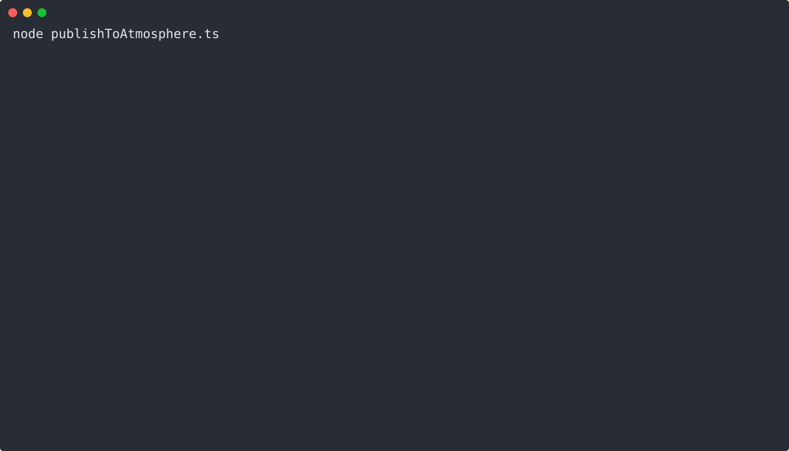

# @mastrojs/atproto

Helper scripts to integrate with the [Atmosphere](https://atproto.com).

Create and update [standard.site](https://standard.site/) records from your existing website without the headache. No need to store [rkeys](https://atproto.com/specs/record-key) in your YAML frontmatter or database. Instead, we derive them from the URL paths of your existing website. For more info, see [our blog post](https://mastrojs.github.io/blog/2026-06-05-how-to-add-standard-site-support-to-your-website/).



## How?

The easiest way to get started, is to [set up a new Mastro project](https://mastrojs.github.io/#powerful-for-experienced-developers) and select the blog template.

But you can use this library with any stack that allows you to get your blog posts into a JavaScript variable. Simply call `createOrUpdateStandardSite(session, publication, docs)` whenever your blog posts changed – e.g. for a statically generated site, on each deploy.


## Install

### Deno

    deno add jsr:@mastrojs/atproto

### Node.js

    pnpm add jsr:@mastrojs/atproto

### Bun

    bunx jsr add @mastrojs/atproto


## Usage

Create a new file, e.g. `publishToAtmosphere.ts`, with the following content and adjust with your settings:

```ts
import fs from "node:fs/promises";
import { createOrUpdateStandardSite, type Publication } from "@mastrojs/atproto";
import { readMarkdownFiles } from "@mastrojs/markdown";

const identifier = "your.bsky.social";
const password = process.env.ATPROTO_PASSWORD;
const publicationUrl = new URL("https://example.com/blog/");

const publication: Publication = {
  url: publicationUrl,
  name: "Peter's Blog",
  description: "",
  // Optional square image for the publication, should be at least 256x256:
  icon: {
    blob: await fs.readFile("icon.png"),
    mimeType: "image/png",
  },
  // Optional RGB colors, make sure you have enough contrast:
  basicTheme: {
    background: { r: 255, g: 255, b: 255 },
    foreground: { r: 23, g: 24, b: 28 },
    accent: { r: 0, g: 0, b: 0 }, // button color
    accentForeground: { r: 255, g: 255, b: 255 }, // button text
  },
};

const posts = await readMarkdownFiles<{title: string; date: string}>("data/posts/*.md");
const docs = posts.map((p) => ({
  title: p.meta.title,
  publishedAt: new Date(p.meta.date),
  url: new URL(p.slug + "/", publicationUrl),
}));

await createOrUpdateStandardSite({ identifier, password }, publication, docs);
```

### 1. Run the script the first time to set things up

[Create an app password](https://bsky.app/settings/app-passwords) and run the above script with it:

#### Deno

    ATPROTO_PASSWORD=xxxx-xxxx-xxxx-xxxx deno run -A publishToAtmosphere.ts

#### Node.js

    ATPROTO_PASSWORD=xxxx-xxxx-xxxx-xxxx node publishToAtmosphere.ts

#### Bun

    ATPROTO_PASSWORD=xxxx-xxxx-xxxx-xxxx bun publishToAtmosphere.ts

If you confirm that everything looks good, the script will create a publication in the Atmosphere, and write a file to `baseDir + "/.well-known/site.standard.publication" + suffix`.

- `baseDir` defaults to `"routes"` – the name of the folder that may be called `public` or similar in other frameworks – use the `opts` argument of [createOrUpdateStandardSite](https://jsr.io/@mastrojs/atproto/doc/~/createOrUpdateStandardSite) to customize.
- If your `publicationUrl` has no path, `suffix` will be the empty string. But if it's e.g. `https://example.com/blog/`, then `suffix` will be `/blog/index.html`.

Add the file to your git repository. It contains your publication's AT-URI (which needs to be served under that URL by your website). The file also serves as a marker for the script on subsequent runs (so that it doesn't create a new publication in the Atmosphere on each run).

### 2. Run the script again to publish documents

After that, run the script a second time to publish your documents to the Atmosphere.

Optionally, you can then set up your CI/CD pipeline to run the script on each deploy. From now on, each time you run the script, it will update the document records in the Atmosphere. Just make sure you don't change the publicationUrl and document urls anymore now, otherwise you'll get duplicate records.

### 3. Add link tag to your HTML

Don't forget to add the `<link rel="site.standard.document"` tag to your document detail pages. The script outputs the correct snippet containing your DID so that you can copy it.


## Verification

You can use e.g. https://site-validator.fly.dev or [pdsls.dev](https://pdsls.dev) to verify [standard.site](https://standard.site/) records on the PDS.
If the validator complains that the document path does not start with `/` and publication URL has trailing slash, see [this issue for an explanation](https://github.com/mastrojs/atproto/issues/5#issuecomment-4716085056).

To browse, edit and delete records manually, use [Taproot](https://atproto.at).


## API Docs

To see all functions and types `@mastrojs/atproto` exports (e.g. various ways to [authenticate](https://jsr.io/@mastrojs/atproto/doc/~/Auth)), see its [API docs](https://jsr.io/@mastrojs/atproto/doc).


## Contribute

This project is happy to accept bug reports and/or contributions! Just open a GitHub issue or talk to us on [Bluesky](https://bsky.app/profile/mastrojs.bsky.social)
